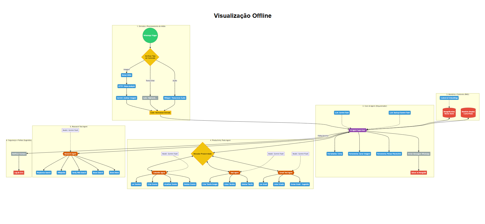
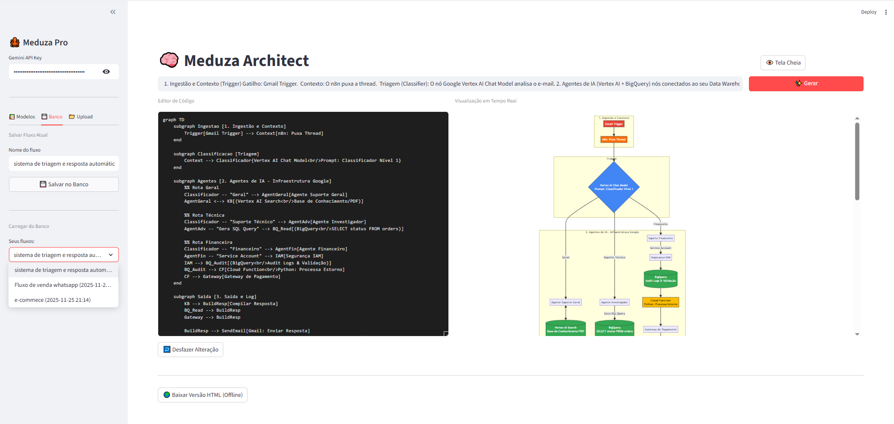
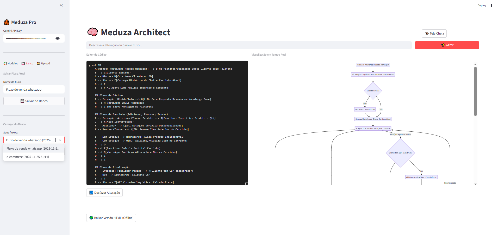
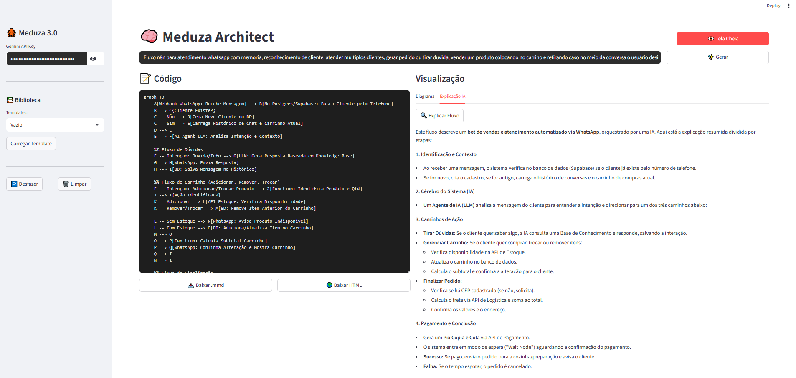
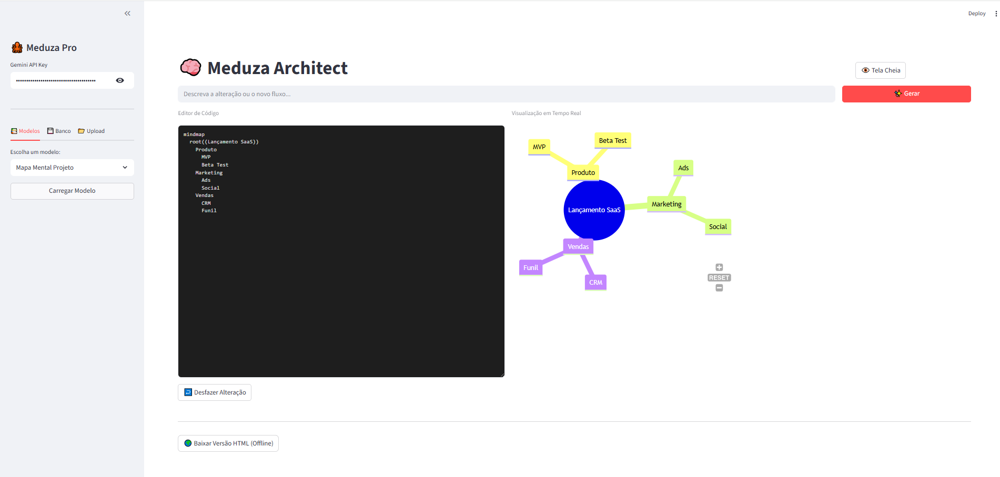

# 🐙 Meduza Architect Pro



**Gerador de Diagramas Inteligente com IA (Gemini) e Streamlit**

O **Meduza Architect Pro** é uma ferramenta open-source desenvolvida para arquitetos de software, desenvolvedores e gestores de produto. Ela elimina a necessidade de arrastar caixinhas manualmente, permitindo criar fluxogramas, mapas mentais e diagramas de sequência complexos usando apenas **texto natural** e o poder do **Google Gemini AI** renderizados via **Mermaid.js**.



## ✨ Funcionalidades

* **🤖 Text-to-Diagram:** Descreva seu fluxo (ex: "Sistema de triagem de e-mails com n8n e BigQuery") e a IA gera o código Mermaid instantaneamente.
* **🛠️ Editor & Preview Real-Time:** Edite o código gerado manualmente e veja as alterações em tempo real.
* **💾 Banco de Dados Local:** Salve seus diagramas favoritos em um banco SQLite integrado para acessar depois.
* **📂 Importação/Exportação:**
    * Importe arquivos `.mmd` ou `.txt`.
    * Exporte para **HTML Offline** interativo.
* **🎨 UI Otimizada:** Interface Dark Mode focada em produtividade com modo "Tela Cheia".
* **🔄 Auto-Correção:** Se o código gerado quebrar, um clique pede para a IA corrigir a sintaxe.

## 📸 Screenshots

### Editor Poderoso e Visualização
A interface divide a tela entre o editor de código e o diagrama renderizado.


### Exemplo de Fluxo Complexo (Automação WhatsApp)
Criação de fluxos de decisão complexos com múltiplos nós e integrações.


### Mapas Mentais
Ideal para brainstorming de projetos e MVPs.


## 🚀 Instalação e Uso

### Pré-requisitos
* Python 3.9+
* Uma API Key do Google Gemini (Google AI Studio)

### Passos

1.  **Clone o repositório**
    ```bash
    git clone [https://github.com/seu-usuario/meduza-architect.git](https://github.com/seu-usuario/meduza-architect.git)
    cd meduza-architect
    ```

2.  **Crie um ambiente virtual**
    ```bash
    python -m venv .venv
    source .venv/bin/activate  # No Windows: .venv\Scripts\activate
    ```

3.  **Instale as dependências**
    ```bash
    pip install streamlit streamlit-mermaid google-generativeai
    ```

4.  **Execute a aplicação**
    ```bash
    streamlit run fluxocognos.py
    ```

5.  **Acesse no navegador**
    O app abrirá automaticamente em `http://localhost:8501`. Insira sua API Key na barra lateral e comece a criar!

## 🛠️ Tecnologias Utilizadas

* [Streamlit](https://streamlit.io/) - Framework de UI
* [Google Gemini](https://ai.google.dev/) - Motor de Inteligência Artificial
* [Mermaid.js](https://mermaid.js.org/) - Renderização de Diagramas
* [SQLite](https://www.sqlite.org/index.html) - Persistência de dados local

## 📄 Licença

Este projeto está sob a licença MIT. Sinta-se livre para contribuir!

---
Desenvolvido por **Ricardo Barbosa de Meneses**
