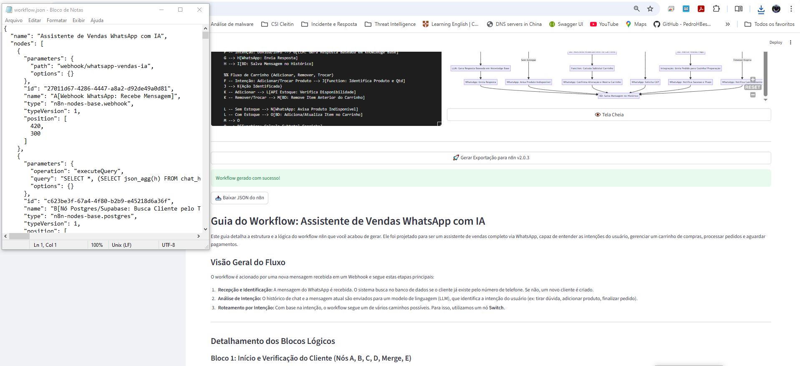

"https://meduza-architect.streamlit.app/"

🐙 Meduza Architect Pro
Meduza Architect é uma ferramenta de engenharia de prompts e arquitetura de sistemas que transforma descrições em linguagem natural em diagramas Mermaid.js e fluxos de automação prontos para o n8n. Utilizando o poder do Google Gemini 2.5 Pro, ele permite desenhar, visualizar e exportar workflows complexos de IA em segundos.

✨ Funcionalidades Principais
IA Generativa de Diagramas: Descreva a lógica do seu sistema e veja o código Mermaid.js ser gerado e renderizado instantaneamente.

Estilo n8n Nativo: Opção para estilizar diagramas com a identidade visual do n8n (nós, cores e formas específicas).

Exportação Direta para n8n: Gera automaticamente o arquivo .json compatível com a versão v2.0.3+ do n8n, pronto para importar e rodar.

Guia de Workflow Automático: Além do código, a IA gera um tutorial detalhado (Markdown) explicando cada bloco lógico do fluxo criado.

Banco de Dados Local: Salve e gerencie seus rascunhos de arquitetura diretamente na interface via SQLite.

Interface Multi-Modal: Suporte para fluxos que envolvem texto, imagem (Vision) e áudio (Whisper).

🚀 Tecnologias Utilizadas
Linguagem: Python 3.10+

Framework Web: Streamlit

Modelo de IA: Google Gemini 2.5 Pro

Renderização: Mermaid.js (via streamlit_mermaid)

Banco de Dados: SQLite3

🛠️ Como Instalar e Rodar
Clone o repositório:

Bash

git clone https://github.com/seu-usuario/meduza-architect.git
cd meduza-architect
Instale as dependências:

Bash

pip install streamlit streamlit-mermaid google-generativeai
Execute a aplicação:

Bash

streamlit run fluxocognos.py
Configuração:

Insira sua Gemini API Key na barra lateral.

Comece a descrever seu fluxo no campo "Comando IA" (ex: "Crie um fluxo de vendas para WhatsApp que verifica se o cliente existe no banco Postgres").

📸 Demonstração
O Meduza Architect permite criar arquiteturas avançadas de Agentes Orquestradores, onde um agente central (Supervisor) delega tarefas para sub-agentes especialistas (Pesquisa, Produtividade, etc).

📄 Exemplo de Fluxo Gerado
Ao utilizar o comando de exportação, o sistema gera:

Diagrama Visual: Representação gráfica no editor.

Workflow JSON: Código pronto para o n8n.

Documentação:

Bloco 1: Verificação de Cliente (Postgres/Supabase).

Bloco 2: Análise de Intenção com LLM.

Bloco 3: Fluxo de Carrinho e Finalização de Pedido.

🤝 Contribuições
Contribuições são bem-vindas! Sinta-se à vontade para abrir uma Issue ou enviar um Pull Request.

📜 Licença
Distribuído sob a licença MIT. Veja LICENSE para mais informações.

Desenvolvido para arquitetos de soluções e entusiastas de automação IA.

Gostaria que eu gerasse também o arquivo requirements.txt ou uma seção específica sobre como configurar as chaves de API do Google Cloud?
